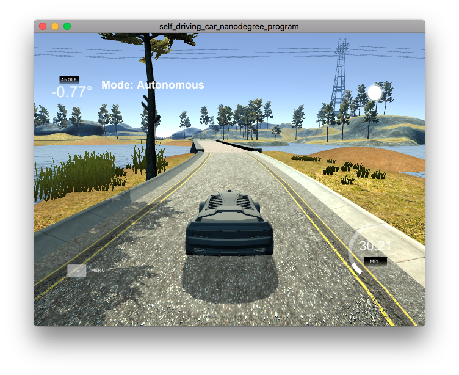

# PID Controller
Udacity Self-Driving Car Engineer Nanodegree Program

---

This project uses a [PID controller](https://en.wikipedia.org/wiki/PID_controller) to control the steering and throttle of a moving vehicle in a simulator. A PID controller uses three components:
* "P" (Proportional) A measure of the error relative to the desired position. In this project, the error is defined as distance from the center of the lane, or miles per hour difference from the target velocity. In an intuitive sense, the "P" is a measure of how far the controller needs to push to get to the correct value.
* "I" (Integral) A cumulative sum of all error measurements over time. The "I" term is a measurement of bias in the system. While the vehicle in the simulator has near-perfect alignment, resistance to forward motion presents a constant bias against the throttle. Measuring and adjusting for that bias allows the vehicle to properly hit the target velocity.
* "D" (Derivative) A measurement of the difference between the current and previous error measurements. Using this measurement antagonistically to the "P" error allows the controller to dampen oscillation.

The simulator can be downloaded from the [Udacity github repository](https://github.com/udacity/self-driving-car-sim/releases).

The supporting websockets code (using the [uWebSockets library](https://github.com/uNetworking/uWebSockets)) and project structure come from the [Udacity repository](https://github.com/udacity/CarND-Kidnapped-Vehicle-Project).
The README at that repository has extensive details for build and setup.

## Basic Build Instructions

1. Clone this repo.
1. `mkdir build`
1. `cmake .. && make && ./pid`

## Files
[PID.cpp](https://github.com/gardenermike/pid-controller/blob/master/src/PID.cpp) implements the PID filter.
[main.cpp](https://github.com/gardenermike/pid-controller/blob/master/src/main.cpp) handles websocket events, and uses an instance of the PID class for both throttle and steering.

## Discussion

Most of the interesting work in this project was done around the steering controller. The throttle was much less finicky.

The basic concept of the PID controller is pretty straightforward, and I had it quickly implemented. See above for a brief description of each of the P/I/D components. Most of the time in this project was spent tuning the weight parameters for each of the three components. I began by zeroing out the integral and derivative terms, and adjusting the proportional component until the vehicle returned to the center of the lane around sharp turns, but did not oscillate off of the track by over-correcting. Increasing the value improved sensitivity, while decreasing the value prevented overcorrection. The "P" term was not sufficient to consistently keep the vehicle on the track. I just aimed to get in the ballpark.

Once I had a generally correct "P" weight, I added the "D" term. The derivative term has a damping effect on the error correction from the "P" term. I found that the damping effect required me to increase the proportional term as well, since the derivative term counteracted it. I logged the weighted error terms and adjusted the "D" term until it was in the same order of magnitude as the "P" term, but lower in most cases. My goal was to make the "D" term sufficient to dampen oscillations quickly. This balance worked out well in practice: I made only some slight adjustments further to get good performance consistently on the track.

Finally, I added a weight for the "I" term. Adding too much weight to this term contributed to wild oscillations in the steering, as any slight deviation from the lane center would result in a high overcorrection. Since the steering the simulator was not significantly misaligned, I kept the value low. Interestingly, logging showed a consistent but small bias in the steering error, leading to a non-zero (but tiny) "I" value. For the throttle controller, the "I" term was very significant. Without it, resistance to acceleration prevented the controller from ever reaching the target speed unless the proportional term was set to be so aggressive that the steering controller could not compensate properly during acceleration. Using the integral term, I was able to achieve smooth acceleration and still reach the target speed, which I set at 30 mph.

Once I had hand-tuned the parameters, I explored automating the process. I used the "twiddle" algorithm as described by Sebastian Thrun, which is a variant of [coordinate descent](https://en.wikipedia.org/wiki/Coordinate_descent). Instead of resetting the simulator after each round, which would require manual intervention, I simply reset my internal parameters after every 600 messages from the simulator, which was approximately one loop around the track. At each round, I added or subtracted a small value to the weights for the steering controller, keeping the new weight if the resulting error was lower than the previous lowest error. I experimented with both maximum error and with mean squared error, neither of which seems to be notably superior. In one long run, I ran the algorithm for 36,000 messages from the simulator, approximately 60 loops around the track. What I found was that the "P" and "I" terms barely moved; the differences seemed to be only random noise. The "D" term, however, wandered by as much as 30%. When the "D" term climbed too high, however, it began to cause counterproductive behavior, leading to uncontrolled oscillation and the vehicle leaving the track. I adjusted my hand-tuned "D" value up slightly based on the "twiddle" results, about 7%. The final weights are on [line 37 of main.cpp](https://github.com/gardenermike/pid-controller/blob/master/src/main.cpp#L37).

The driving results from the PID controller are not as smooth as the results from [my previous project using a deep neural network](https://github.com/gardenermike/behavioral-cloning), but they compare quite favorably, at a far smaller computational cost. Assuming that a valid cross-track error would be available in an autonomous driving scenario (which is plausible given high quality mapping and localization), a PID controller for steering seems an attractive option.
